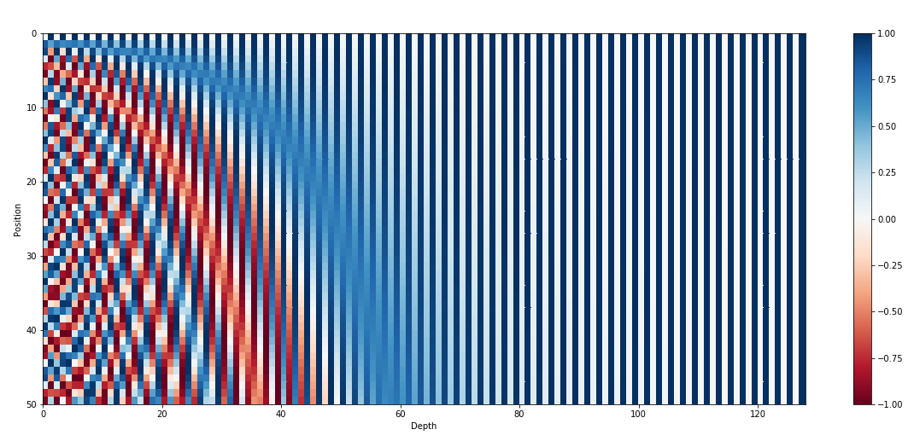

# Transformers
Nowadays, transformers are the hittest topic that everyone is whispering about. Any new models and approaches either use 
transformers themselves or use the idea in them, so I felt my github sea is empty without this fish :D. I'm going to 
simply go through [Transformer model for language understanding](https://www.tensorflow.org/text/tutorials/transformer) 
tutorial.

# Project Goal
We want to train a transformer model to translate a Portuguese to English dataset. We try to code mostly from scratch 
but can be minimized taking advantage of built-in APIs like tf.keras.layers.MultiHeadAttention.

# Advantages vs Disadvantages
It uses stacks of self-attention layers instead of RNNs or CNNs.

### Upsides
1. It makes no assumption about temporal/spatial relationships across the data.
2. Parallelizable (in contrast to RNN)
3. It can learn long-range dependencies.

### Downsides
1. For a time-series, the output for a time-step is calculated from the entire history instead of only the inputs and 
current hidden-state. This may be less efficient.
2. If the input does have a temporal/spatial relationship, like text, some positional encoding must be added or the 
model will effectively see a bag of words.

# Dataset
The dataset is Portuguese-English translation dataset which contains approximately 50000 training examples, 1100 
validation examples, and 2000 test examples.

# Text tokenization & detokenization
The text needs to be converted to some numeric representation first. Typically, you convert the text to sequences of 
token IDs, which are used as indices into an embedding. One popular implementation builds subword tokenizers 
(text.BertTokenizer) optimized for this dataset and exports them in a saved_model.

# Positional encoding

Attention layers see their input as a set of vectors, with no sequential order. This model also doesn't contain any 
recurrent or convolutional layers. Because of this a "positional encoding" is added to give the model some information 
about the relative position of tokens in the sentence.

The positional encoding vector is added to the embedding vector. Embeddings represent a token in a d-dimensional space
where tokens with similar meaning will be closer to each other. But the embeddings do not encode the relative position 
of tokens in a sentence. So after adding the positional encoding, tokens will be closer to each other based on the 
**similarity of their meaning and their position in the sentence**, in the d-dimensional space.

The formula for calculating the positional encoding is as follows:

## Intuition on the formula
We want to bring word order information to transformers. How about we introduce a set of vectors containing the position
information called position embeddings and add them to the previous embedding but what values should our position 
embeddings contain :thinking:

1. Why not simply consider the word position number

adding the position information like this may significantly distort the embedding information, for example if the text 
has 30 words, the last embedding will be added to the huge number of 30.

2. What if instead we added fractions

This way the maximum embedding value will not surpass 1. It doesn't work either because making the position embeddings a 
function of the total text length would mean **if the sentences differ in length they would possess different position 
embeddings for the same position this may in turn confuse the model**

Ideally, the position embedding values at a given position should remain the same irrespective of the text or any other 
factor.

3. The authors used wave frequencies to capture position information. Let's take the first position embedding as an 
example therefore the pos variable in the formula will be 0. Next the size of the position embedding has to be the same 
as the word embedding this is represented by the letter d in the formula. The letter i here represents the indices of 
each of the position embedding dimensions

### Why does it work?
Now if we plot a sinusoidal curve by varying the variable indicating board positions on the x-axis we will get a smooth 
looking curve, **since the curve height only varies between a fixed range and is not dependent on the text length**, 
this method can help us overcome the limitation previously discussed.

There is a problem though, note the embeddings of position 0 and 6 are exactly the same. This is when the next variable 
in the equation, the i, comes to rescue. If we plot the curve at different values of i's we get a series of curves with 
different frequencies. Now if you read the value of the position embedding for positions zero and six, for i=4 they will 
be exactly the same but for i = 0 for example they are very different.

This is a positional encoding curve plotted on a full scale, as to get the value of a position embedding at a certain 
dimension, you can simply read off the chart

# Look-Ahead Masking
The look-ahead mask is used to mask the future tokens in a sequence. In other words, the mask indicates which entries 
should not be used.

This means that to predict the third token, only the first and second token will be used. Similarly to predict the 
fourth token, only the first, second and the third tokens will be used and so on.

# Scaled Dot-Product Attention
This is a very important part of the transformers and was a little hard for me to understand in the first place. So I'm
going to explain this part step by step and more detailed.

## Overall
We have a phrase let's say "Bank of the river" which is divided into separate tokens and for each token we have a word
embedding or a vector and then these vectors would go into an attention mechanism and the goal was that once these 
vectors come out of the attention mechanism, we end up with vectors that have a little more context.

In this example if we look at the word "bank", it is possible that "v1" represents money but because the word "river" is
here, it shouldn't. The hope is that the attention mechanism will correct that by adding context to the embeddings.

## Scaled Dot-Product with No Weight
Let's continue with the four word embeddings, each of them is an array of numbers. But now let's say we want to add 
context to the third vector. The first step is to calculate the dot product and this would give us the scores. The scores 
are great but there is an issue and it's that the scores can be any value and we do like to keep things a little bit 
contained so the next step will be to normalize them, the outputs are denoted by W, a nice property of all of these 
weights is the sum of the Ws should be one. We started with vectors (Vs) and we reached to numbers (Ws). Now we are 
going to reweigh everything together and then combine it.

In the above picture the steps are shown only for the third vector (y3 is the contextualized representation of the third
vector) but the steps will also be repeated for the other ones. One interesting thing here is that there are no weights 
in any of this. Everything that we are doing here doesn't require parameters that are updated during a training loop but 
if we actually introduce some of those parameters then maybe we can learn more patterns then maybe we have more flexible
system.

## Scaled Dot-Product with Weight
When we consider the vectors that we start with (v1, v2, v3, v4), they're used 3 times (shown by arrows). How about we 
don't change any of the operations in the middle but add some weights right there and maybe we can make a database 
analogy here because you can say hey I have a "Query" here, I'm asking that the third vector get a little bit more 
context. The initial word embedding vectors are the "keys" then when we've combined a query with the keys we want to get
back the values. Well, the analogy with databases doesn't hold perfectly here but it gives us opportunity to give nice 
names to parameters. So what we'll do is introducing query parameters, key parameters and value parameters

Now let's think about how to add parameters, we have word embedding vectors, we can multiply that out with a matrix and
get another vector out. So how about this, I'm going to create a matrix for all of my keys. So all the key vectors are
going to get multiplied with this matrix called "key matrix". 

Now these matrices values can be updated during training and this can be modeled by neural networks.

## Complete Architecture
I start with the word embeddings in the left (n vectors). Let's pass these vectors through linear layers, these layers 
don't have bias term so they are exactly like matrix multiplication. If we then perform a matrix multiplication of the 
output of the first two layers well then what comes out is a matrix of all of our scores and then if we normalize the 
scores properly then we have our normalized weights like before and then at the end if we multiply that with our values
what we get out is the collection of contextualized embeddings.

## Parameters Help
Suppose the word embeddings go through the two self attention blocks so we have context being added twice and if all of 
this is followed with a named entity recognition task then we are going to get a gradient signal coming back and this 
signal helps to update these self attention blocks. Signals come in and it's propagating information back eventually to 
the weights of my keys, queries and values layer. So now we got an attention mechanism that can learn and we can click 
together.

## Summary

The attention function used by a transformer takes three inputs: Q(query), K(key), V(value). The equation used to 
calculate the attention weights is:

The dot-product attention is scaled by a factor of square root of the depth. This is done because for large values of 
depth, the dot product grow large in magnitude pushing the softmax function where it has small gradients resulting in a 
very hard softmax.

For example, consider that "Q" and "K" have a mean of 0 and variance of 1. Their matrix multiplication will have a mean 
of 0 and variance of "dk". So the square root of "dk" is used for scaling, so you get a consistent variance regardless 
of the value of "dk". If the variance is too low the output may be too flat to optimize effectively. If the variance is 
too high the softmax may saturate at initialization making it difficult to learn.

The mask is multiplied with -1e9 (close to negative infinity). This is done because the mask is summed with the scaled 
matrix multiplication of Q and K and is applied immediately before a softmax. The goal is to zero out these cells, and 
large negative inputs to softmax are near zero in the output.

# Multi-head attention

Multi-head attention consists of four parts:

* Linear layers
* Scaled dot-product attention
* Final linear layer

Each multi-head attention block gets three inputs; Q(query), K(key), V(value). These are put through linear (Dense) 
layers before the multi-head attention function.

Instead of one single attention head, Q, K and V are split into multiple heads because it allows the model to jointly 
attend to information from different representation subspaces at different positions. After the split each head has a 
reduced dimensionality, so the total computation cost is the same as a single head attention with full dimensionality.